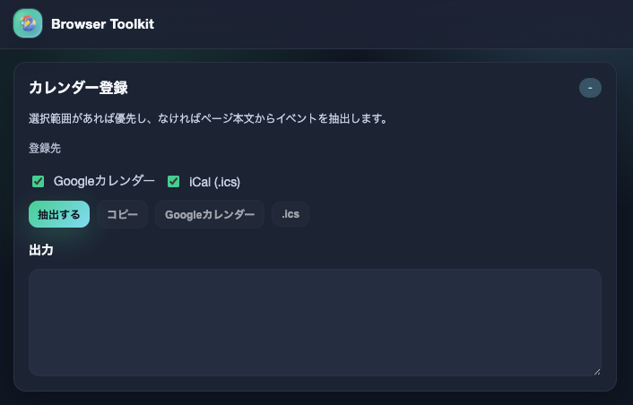
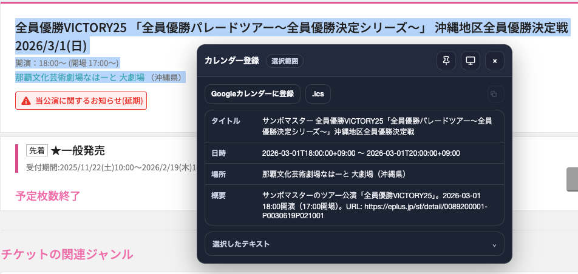
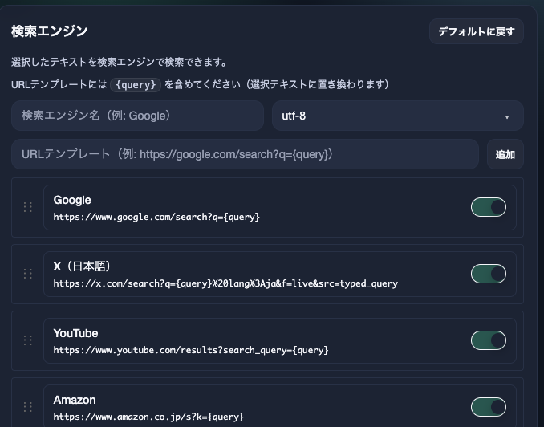
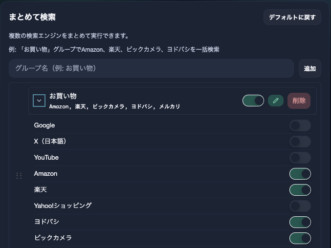

# Browser Toolkit

個人用のツールキット Chrome 拡張（Manifest V3）です。自分が欲しい機能（テーブルソート、AI問い合わせ、翻訳、レビューなど）を詰め込んだツール集です。

主な機能:

- テーブルをクリックでソート（動的に追加されるテーブルも対応）
- OpenAI を使った「Context Actions」（要約/翻訳/カレンダー抽出）をポップアップと右クリックから実行
- リンク作成（タイトル+URLを複数形式でコピー）
- 検索エンジン（選択テキストをカスタム検索エンジンで検索）
- テキストテンプレート（定型文を右クリックから貼り付け）

## スクリーンショット

### カレンダー登録



選択範囲やページ本文からイベント情報を抽出し、GoogleカレンダーやiCalに登録できます。



イベントページで実行すると、自動的にタイトル・日時・場所・概要を抽出してカレンダーに登録できます。

### 検索エンジン



選択テキストをカスタム検索エンジンで検索できます。URLテンプレートに `{query}` を含めて自由に追加できます。

### まとめて検索



複数の検索エンジンをグループ化して、一度に複数のサイトで検索できます。例えば「お買い物」グループでAmazon、楽天、ビックカメラ、ヨドバシを一括検索できます。

## 機能

### テーブルソート

- `<th>` ヘッダーをクリックでソート（昇順/降順をトグル）
- 数値/文字列を自動判定
- 自動有効化:
  - すべてのサイトで有効化、または
  - URL パターンに一致するサイトだけ自動有効化（`*` ワイルドカード対応 / protocol は無視）
- `MutationObserver` で新しく挿入されたテーブルも自動検出
- 行フィルタリング: 0円/ハイフン/空白/N/A の行を非表示（パターンごとにON/OFF）

### Context Actions（OpenAI 連携）

- 実行方法:
  - ポップアップ → **アクション** タブ、または
  - 右クリック → **browser-utils** → アクション
- 組み込みアクション:
  - **要約**（日本語）
  - **日本語に翻訳**
  - **コードレビュー**
- カスタムアクション:
  - ポップアップで作成/編集/削除/リセット可能
  - テンプレ変数: `{{text}}` / `{{title}}` / `{{url}}` / `{{source}}`
- ドラッグ&ドロップで並び替え可能（右クリックメニューの順序に反映）
- 結果表示:
  - ポップアップの出力パネル（コピー）
  - 右クリック実行時はページ上にオーバーレイ表示（コピー / 固定 / ドラッグ）

詳細は `docs/context-actions.md` を参照してください。

### リンク作成

- 現在のタブのタイトルとURLを複数形式でクリップボードにコピー
- 対応形式:
  - URL
  - テキスト（タイトル + 改行 + URL）
  - Markdown: `[タイトル](URL)`
  - HTML: `<a href="URL">タイトル</a>`
  - Org-mode: `[[URL][タイトル]]`
  - BBCode: `[url=URL]タイトル[/url]`
- 右クリック → **Browser Toolkit** → **タイトルとリンクをコピー** でも実行可能

### 検索エンジン

- 選択テキストを任意の検索エンジンで検索
- デフォルト: Google, Amazon, 楽天, ヨドバシ、X、ビックカメラ
- カスタム検索エンジン追加可能（URLテンプレートに `{query}` を含める）
- ドラッグ&ドロップで並び替え可能（右クリックメニューの順序に反映）
- 右クリック → **Browser Toolkit** → **検索** → エンジン名

### テキストテンプレート

- 定型文を右クリックメニューから素早く貼り付け
- デフォルトテンプレート:
  - **LGTM** - コードレビュー用
  - **ありがとうございます** - 感謝の定型文
- カスタムテンプレート: ポップアップで追加/編集/削除可能
- ドラッグ&ドロップで並び替え可能（右クリックメニューの順序に反映）
- 右クリック → **Browser Toolkit** → **テキストテンプレート** → テンプレート名

## インストール（パッケージ化されていない拡張機能）

1. 依存関係インストール + ビルド:
   - `pnpm install`
   - `pnpm run build`（`dist/` を生成）
2. Chrome で `chrome://extensions/` を開く
3. **デベロッパーモード** を有効化
4. **パッケージ化されていない拡張機能を読み込む** をクリックし、`manifest.json` がある `browser-toolkit/` のルートを選択（`dist/` や `dist/Chrome` ではなくリポジトリ直下）

## 使い方

### テーブルソート

ポップアップ → **テーブルソート** タブ:

- **このタブで有効化**: 現在のタブで即時有効化
- **URL パターン**: 例
  - `*.moneyforward.com/bs/*`
  - `example.com/path*`

### Context Actions

- ポップアップ（**アクション** タブ）から実行: 選択範囲 → 直近の選択キャッシュ（約30秒）→ ページ本文の順にフォールバックします
- 右クリックから実行: 右クリックメニュー → **Browser Toolkit** → アクション

## 設定

ポップアップ → **設定** タブ:

- OpenAI API Token（`chrome.storage.local` に保存。同期されません）
- モデルID（デフォルト `gpt-5.2`。プリセット選択 + 任意のモデルIDを入力可）
- 追加指示（任意。出力の口調やフォーマットの好みに）
- テーマ（ダーク/ライト。ポップアップと注入 UI に反映）

## 開発

### 必要要件

- Node `24以上`
- pnpm `10.26.0`
- `mise`（任意・推奨。ツールバージョンを揃えるため）

### セットアップ

1. `mise` を使う場合は `mise trust` でリポジトリを信頼します（シェル起動時のエラー回避）。
2. 依存関係をインストールします: `pnpm install`
3. **本番ビルドの場合**: GA4エラー監視用の環境変数を設定します（開発ビルドでは不要）:
   ```bash
   cp .env.example .env
   # .env ファイルを編集して GA4_MEASUREMENT_ID と GA4_API_SECRET を設定
   ```
4. ローカルで検証する場合は開発サーバーまたは Storybook を起動します:
   - `pnpm run dev`（開発サーバー: 自動ビルド + 拡張機能の自動リロード）
   - `pnpm run watch`（自動ビルドのみ、リロードは手動）
   - `pnpm run storybook`（UI をブラウザで確認）
5. 準備ができたら `pnpm run build` を実行し、`manifest.json` があるリポジトリ直下（`browser-toolkit/`）を Chrome に読み込みます（`dist/` ではありません）。

### コマンド

基本は `mise` タスクを使います:

- `mise run format`（Ultracite/Biome による自動整形）
- `mise run lint`（型チェック + Lint）
- `mise run test`（Vitest ユニットテスト）
- `mise run test:storybook`（Storybook/Vitest addon のテスト）
- `mise run build`（`dist/` へバンドル）
- `mise run ci`（format + lint + test + storybook test + build）

その他:

- `pnpm run dev`（開発サーバー: 自動ビルド + 拡張機能の自動リロード）
- `pnpm run watch`（bundle の watch）
- `pnpm run storybook`（`http://localhost:6006`）
- `pnpm run test:e2e`（E2Eテスト実行）
- `pnpm run test:e2e:ui`（E2EテストをUIモードで実行）
- `pnpm run test:e2e:debug`（E2Eテストをデバッグモードで実行）
- `pnpm run test:visual`（Visual Regression Testing）
- `pnpm run test:visual:update`（スナップショットの更新）

### 開発モード（自動リロード）

`pnpm run dev` を使うと、ソースコード変更時に自動的に拡張機能がリロードされます。

**使い方:**

1. 拡張機能をChromeに読み込む（通常通り）
2. ターミナルで `pnpm run dev` を実行
3. ソースコードを編集・保存
4. 自動的にビルド → 拡張機能リロードされる（手動リロード不要）

**仕組み:**

- WebSocketサーバー（`ws://localhost:8090`）がファイル変更を検知
- 開発ビルドのbackground scriptが接続し、変更通知を受信
- `chrome.runtime.reload()` で拡張機能を自動リロード

**注意:**

- プロダクションビルド（`pnpm run build`）には自動リロードコードは含まれません
- Content Scriptの変更は拡張機能リロード後、ページのリロードも必要です

### E2Eテスト

Playwright を使用したE2Eテストで、拡張機能の動作を自動検証します。

**実行方法:**

```bash
# 拡張機能をビルド（最初に1回）
pnpm run build

# E2Eテストを実行
pnpm run test:e2e

# UIモードで実行（推奨: デバッグに便利）
pnpm run test:e2e:ui

# デバッグモードで実行
pnpm run test:e2e:debug
```

**テスト内容:**

- テーブルソート機能（基本ソート、動的テーブル挿入）
- ポップアップUI（ナビゲーション、テーマ永続化、設定表示）

**注意:**

- E2Eテストは `headless: false` で実行されるため、Chromeウィンドウが表示されます
- テスト中にChrome拡張機能が自動的に読み込まれます
- テストfixtureは `tests/e2e/fixtures/` に配置されています

### Visual Regression Testing

Storybook Test Runner + Playwright Snapshotsを使用して、UIの視覚的な変更を自動検出します。

**実行方法:**

```bash
# Storybookを起動（別ターミナル）
pnpm run storybook

# Visual Regression Testを実行
pnpm run test:visual

# スナップショットを更新（意図的な変更の場合）
pnpm run test:visual:update
```

**テスト内容:**

- すべてのStoriesでライト/ダークモードのスナップショットを取得
- 視覚的な差異を自動検出（1%の許容誤差）
- CSSやコンポーネント変更時のリグレッション防止

**スナップショット管理:**

- スナップショットは `__snapshots__/` に保存
- Gitには追跡されない（`.gitignore`で除外）
- ローカルで検証し、意図的な変更のみ承認

**注意:**

- Storybookが起動している状態で実行してください
- 初回実行時はすべてのスナップショットが作成されます
- UIの意図的な変更後は `test:visual:update` でスナップショットを更新してください

## プロジェクト構成

```
browser-toolkit/
├── dist/                      # bundle 出力（生成物）
├── docs/                      # ドキュメント
│   ├── context-actions.md     # Context Actions ガイド
│   ├── icon-setup.md          # アイコン作成手順
│   └── style-management.md    # Design Tokens / テーマ
├── manifest.json              # 拡張機能マニフェスト（MV3）
├── popup.html                 # ポップアップのエントリ（popup_bootstrap.js 経由で dist/popup.js を読む）
├── src/
│   ├── background.ts          # service worker（コンテキストメニュー + OpenAI 呼び出し）
│   ├── content.ts             # content script（テーブルソート + オーバーレイ + 選択キャッシュ）
│   ├── popup.ts               # ポップアップ（React root）
│   ├── popup/                 # ポップアップ UI（React + Base UI）
│   ├── content/overlay/       # オーバーレイ UI（React + Base UI / Shadow DOM）
│   ├── openai/                # OpenAI 設定
│   └── ui/                    # 共通 UI（theme/styles/toast）
└── tests/                     # Vitest（jsdom + chrome stubs）
```

## プライバシー/セキュリティ

- OpenAI API Token は `chrome.storage.local` に保存（同期なし）
- URL パターン/アクション定義などの非機密設定は `chrome.storage.sync` に保存
- 選択テキストは安定動作のためローカルに短時間キャッシュされることがあります（fresh 判定は約30秒）
- OpenAI への送信は **Context Action を明示的に実行した場合のみ** 発生します

### エラー監視（Google Analytics 4）

本番環境でのエラー発生を検知するため、Google Analytics 4 (GA4) Measurement Protocolを使用してエラー情報を収集します。

**収集される情報:**

- エラーメッセージ（スタックトレース）
- エラー発生場所（background/content/popup）
- 拡張機能のバージョン

**収集されない情報（プライバシー保護）:**

- OpenAI API Key（自動的に除去）
- URLのパスパラメータ（ドメインのみ）
- ユーザー入力テキスト

**送信タイミング:**

- 本番環境（`process.env.NODE_ENV === "production"`）でのみ送信
- 開発環境では送信されません（コンソールログのみ）

**認証情報の管理:**

- GA4認証情報（Measurement ID、API Secret）は環境変数から注入されます
- ソースコードにはハードコードされません（`.env.example` を参照）
- ビルド時に環境変数 `GA4_MEASUREMENT_ID` と `GA4_API_SECRET` を設定してください

## ライセンス

ISC
